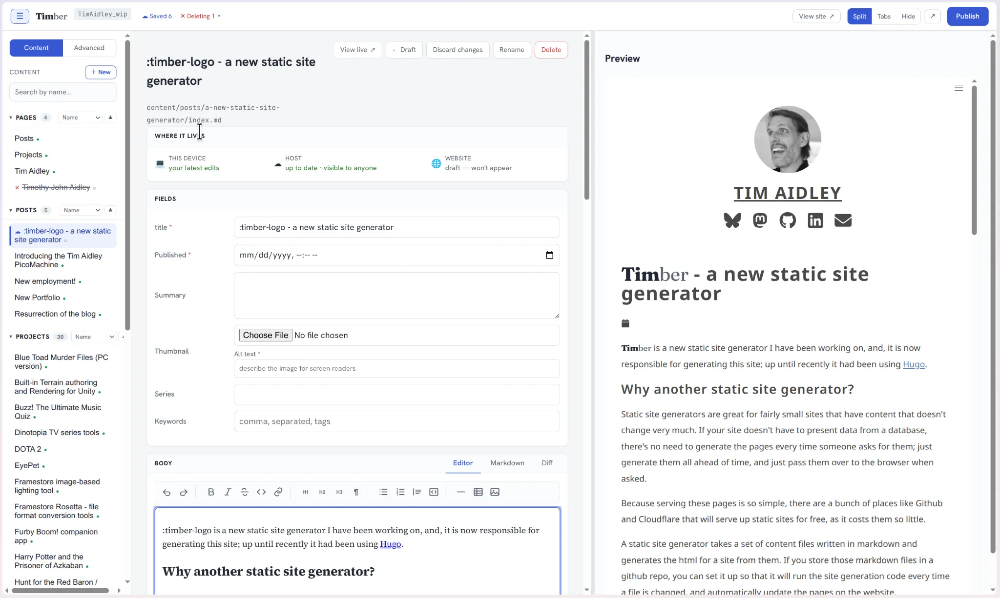

:timber-logo is a new static site generator I have been working on, and, it is now responsible for generating this site; up until recently it had been using [Hugo](https://gohugo.io).

<!--more-->

## Why another static site generator?
Static site generators are great for fairly small sites that have content that doesn't change very much. If your site doesn't have to present data from a database, there's no need to generate the pages every time someone asks for them; just generate them all ahead of time, and just pass them over to the browser when asked.

Because serving these pages is so simple, there are a bunch of places like GitHub and Cloudflare that will serve up static sites for free, as it costs them so little.

A static site generator takes a set of content files written in markdown and generates the html for a site from them. If you store those markdown files in a GitHub repo, you can set it up so that it will run the site generation code every time a file is changed, and automatically update the pages on the website.

## Missing the ease of Wordpress

I liked using Hugo as a static site generator for my site, but I kinda missed being able to just edit my pages in a web browser, like you can with [Wordpress](https://wordpress.org/). It's nice to be able to add a post from anywhere without having to install the site generator on the computer, clone the repo, and make changes. In theory you can just go and edit the markdown directly on GitHub, but then you don't get a preview of what it would look like.

Any why not use Wordpress? It's a dynamic site, which means you need to find a hosting solution to run it. Also, it annoys me that in Wordpress you get two kinds of item (Pages and Posts), and nothing else, and if you want to define a new kind of item, you need to download or write a plugin for it.

Now, Wordpress is tremendously powerful and runs some vast proportion of the world's websites, but I wanted something a little different.

## The core idea - run the site generator in a browser

As I thought about my desire to have a static site generator with the ease of use of Wordpress, I realized it might be possible to run a static site generator _within_ the browser. The repository could be cloned in to a RAM filing system, and the site generator run on that, generating the preview pages as needed.

I got an LLM to try prototyping the system. First we tried to get some site generators written in typescript or javascript to run in the browser, but it never quite worked, mainly because they would normally rely on some node library that couldn't run in browser. We also tried running a generator in a webassembly-based virtual machine, but again, no luck. I realized that if I wanted something like that I would probably have to ~~write it myself~~ get an LLM to write something for me.

# :timber-logo : The browser-based static site generator.

:timber-logo is split in to two main parts - the generator and the editor.

## The Generator

- Is a static site generator designed to be runnable in the browser and standalone using node.
- Pages are written in Markdown along with some front matter at the start, much like most of the other static site generators.
- Templates are written in Liquid, much like Jekyll and Eleventy.
- Has some computed collection aliases to provide compatibility with Jekyll and LiquidJS-based Eleventy themes.
- Supports collections of any kind of object the user wants - they are not limited to pages and posts.
- Pages can be marked draft, which will prevent them being built in to the site until they are ready.

The generator itself is nothing particularly unique - it's main special sauce is that everything it needs can be run in a browser; the real magic behind :timber-logo is the editor.

## The Editor

- Clones the repository in to memory
- Presents an interface that allows creation and editing of any content on the site, as well as the templates, settings, themes files etc.
- Constantly rebuilds the page you are working after every change to provide a live preview window.
- The editor uses the [Milkdown](https://milkdown.dev/) markdown rich text editor for a WYSIWYG editing experience.
- Supports image embedding and placing
- Saves all changes to local storage immediately, so the browser crashing, you closing the tab, or refreshing the page will not lose your work.
- After a few seconds it will also commit those changes to a git branch `<user>_WIP` on the git repository, so they are safe from something happening on your computer, or if you want to continue working on your document from somewhere else.
- The 'Publish' button rebases the `<user>_WIP` branch on to `main`, and triggers the publish action on the host (GitHub, Collabra, GitLab, Gitea).
- Authentication is handled by the hosting provider itself, and there are several ways of setting that up (OAuth, device flow, PAT token)

## Other Features

- Multi-language support - you can set up multiple languages, which allows you to add a language switcher to your site. The interface will show you which pages have or have not had translations.
- Themes and theme switching - you can separate the presentation aspects of the site in to a theme, and then switch between  multiple themes.
- Theme import from Jekyll and Eleventy. Obviously nobody has been using :timber-logo except me, so there are no ready-made themes for it. Because of the similarities between the way :timber-logo works and Jekyll and Eleventy, it's possible to import most Jekyll themes an many Eleventy themes, so long as they use liquid for their templating.

## The editing experience

:::figure

My view creating this page.
:::

This is a screenshot of :timber-logo in use. Things to note:

- At the top you can see the git branch that my changes are being saved to. It is the combination of my GitHub username and `_WIP`.\\
- Next to it you can see 'Saved 6  Deleting 1' - this shows me what changes I have currently in my WIP branch. I can click there for details and diffs.
- At the top right you can see options for determining how the preview pane will or will not be shown.
- Along the left is the content panel. By default it shows 'Content', which is largely pages and posts that are visible in the built site. The 'Advanced' panel is similar but shows things like `.liquid` templates. `.yaml` files that define the object types, and also theme files, like `.css, .scss` files etc.
- In the middle is the editing page. It has the title at the top along with the site path and some buttons for performing various operations on it.
- Below that is the panel that shows where your changes live:
  - When you first make a change it is only saved in your local storage.
  - ... but within a few seconds, those changes will be committed to your branch.
    - ( You can if you prefer not have the data mirrored to your branch until publish, if what you're writing is secret or private)
  - Once you hit publish, the page will be generated and published to your site.
- After that are various fields for you to fill in about the page. Exactly what appears here depends on how you set up your pages template, as you can add any fields you want.
- And below that is the main editing section, which has a WYSIWYG editor, but also the option to edit as raw markdown and to see a diff compared to the version currently in `main`.
- Finally, the right-hand panel shows a live preview of your page.

## Publishing your change

Once you are ready to publish, you hit the publish button, and you will be given a dialog box that shows the changes you have made, and you can confirm you wish to publish.

Once you submit, your changes are rebased on to `main`, which will trigger a GitHub action that sets up a container and runs the generator via node, which generates the html pages, which will then get copied to your site.

# Developing :timber-logo with AI

:timber-logo was entirely AI-written; I mainly used Claude Opus to discuss the design with and do the actual programming. I never touched the code at all, and got quite a long way through the project before I even cloned the repository on my computer, because it was possible to create an empty repo on GitHub, give Claude access to it, and let it handle that side of things completely.

It was quite interesting developing a program in which my role was entirely production and product direction. I did have a lot of technical input where it affected product direction or user experience, but all of the other technical decisions were made by the robot.

AIs are famously good at making small projects from scratch, and famously bad once those projects get bigger, and I felt as I went along that sometimes the model was beginning to hit the point where it was beginning to sometimes lose its effectiveness.

Although I'm prepared to commission an AI to write code for me, I don't feel the same way about writing English. All of these words are my own.

# Getting :timber-logo

:timber-logo is available at <https://github.com/TimAidley/Timber>, and in includes install instructions. Those were written by The Robot because I had it update the instructions any time it made an update.

I plan to give :timber-logo its own webpage soon, and one thing that will have is an interactive installation guide that only shows you the steps that are relevant to your setup.

I also plan to write a user guide - although I think I'll have to do that, because I don't think it's something The Robot is very good at.

If anyone does have a go with :timber-logo, I'd love to hear about it - feel free to contact me on any of the social links shown on this webpage.

# The future of :timber-logo

For now I intend to keep using :timber-logo for my personal website, and I will continue to make improvements to it until my current bout on enthusiasm dries out. The whole thing is open source, and I'm happy to accept PR for it, and of course if someone wishes to they can fork it. All the notes that Claude made are in the repository, so anyone wishing to add features or fix bugs could probably do quite well just by giving the task to Claude Opus.
