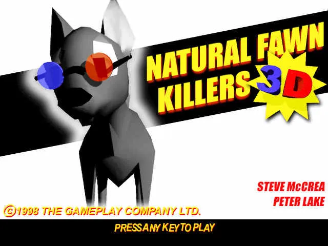
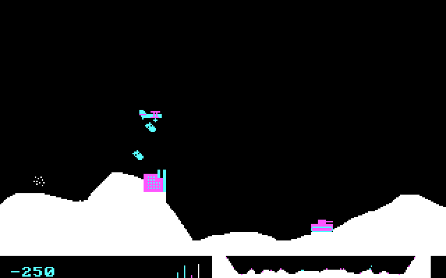
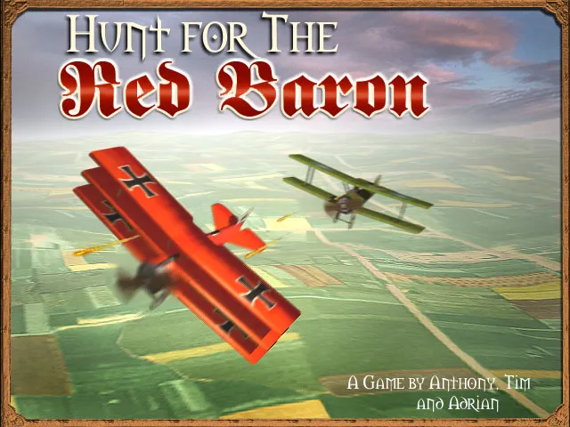

:::figure{layout="wrap-right" size="sm"}

:::

In 1999 I was working as a games programmer in Guildford for Fiendish Games, which was a department of Criterion Studios which was focused on creating and selling so-called 'Electronic Software Download' games, which was a relatively new business model at the time. Our theory was that you could make smaller games more quickly and sell them online for $10-$15. The first game we released was 'Natural Fawn Killers', a spoof deer hunting game that took one programmer and one artist three or four months to complete.

It was my turn to make a game, and so me and my artist colleague Anthony Callaghan went down to the [George Abbot](https://www.greeneking.co.uk/pubs/surrey/george-abbot) for a couple of pints in the afternoon while we discussed what game to make.

:::figure{layout="wrap-right" size="sm"}

:::

I have always loved aeroplanes and as a teenager enjoyed playing the classic IBM PC game 'Sopwith' by BMB Compuscience. The game is side-scrolling, and you control a biplane back and forth, bombing buildings and dogfighting enemy aircraft. One of the very satisfying aspects of the game was the physics of the bombs - it was fun to do a loop-the loop and release the bomb halfway through, and watch it move with a graceful arc before (hopefully) destroying the target.

Our original idea was to do a 'modern' version of that game, with 3d models and backgrounds, but still side-scrolling with very similar gameplay. While Anthony went back and started researching WWI planes, I started up a new project with Renderware, which was the 3D engine that was written and sold by Criterion.

Unfortunately I do not have any in-progress pictures or footage of the game as its development progressed, but fairly early on we decided to move from the 2d side scrolling gameplay to something more properly 3d with a landscape you could fly around; the game was definitely a victim of scope screen - the original plan was to make a game in 3 or 4 months, but as the scope increased so did the development time, coming in at about 9 months overall.

Once we had the basics of flying and shooting in the game, I wrote an in-game mission editor and game designer Adrian Moore joined us part-time to create the missions. Later in the development several other people joined the team (you can see them all in the credits), but the majority of the game was made by the three of us.

## Release and post-release

:::figure{layout="wrap-right" size="sm"}

:::

We released the game in May 2000, and it quickly became Fiendish Games' best seller. Unfortunately it caught the attention of [Sierra Games](https://www.sierragames.com), who at that time owned a trademark on [Red Baron](https://www.sierragamers.com/red-baron/) in videogames, and we were forced to change the name, so we changed it to 'Master of the Skies: The Red Ace' (we thought that maybe it might be the first in a series of 'Master of the Skies' games featuring different pilots of different eras). I never liked the name as much as the original.

A little while after that Criterion decided to shut down Fiendish Games, but they allowed us to license the games we had written there and the team split off in to a new games company, _Small Rockets_, which is why you are more likely to see a copy of the game bearing the Small Rockets brand than the Fiendish Games one.

We started on a Red Ace sequel, which featured multiplayer, and a larger variety of planes. However, its development got put on hold and I left Small Rockets in the summer of 2001. However, Small Rockets restarted the production of the sequel, and it was released as _Red Ace Squadron_.

Small Rockets shut down in 2003, if I recall correctly.

## Resurrecting the Baron

When I left Small Rockets I wasn't allowed to take a copy of the code with me, but after it shut down an ex-colleague of mine gave me a CD of the source, and I've wanted for some time to get it running again. Every few years I would try doing a Unity port of it, but it was always difficult not to make too many improvements, and I never had quite enough mental energy to complete it. It didn't help that the original code is C/COM and Unity was C#.

However, recently I realized that AI has become so advanced now that it's probably quite capable of automating the process of porting it, and so I gave it a try. It was much more successful than I had expected it to be! The core game code has had the Renderware and Dive 5 code removed, so the base game is just standard C++ without any dependencies. The system takes delta time and control input in, and outputs all the data required to render the sene.

The rendering is handled by [raylib](https://www.raylib.com), which is a very simple graphics engine.

The result is a fully working replica of _Hunt for the Red Baron_, and it's very faithful to the original. After I had it working on my PC, I got the AI to port it to webassembly, and you can now play the game online in the browser.
